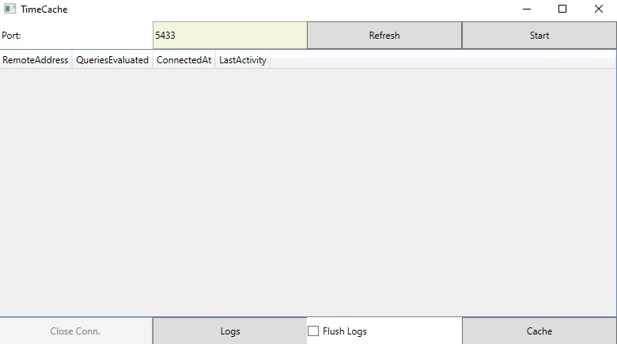
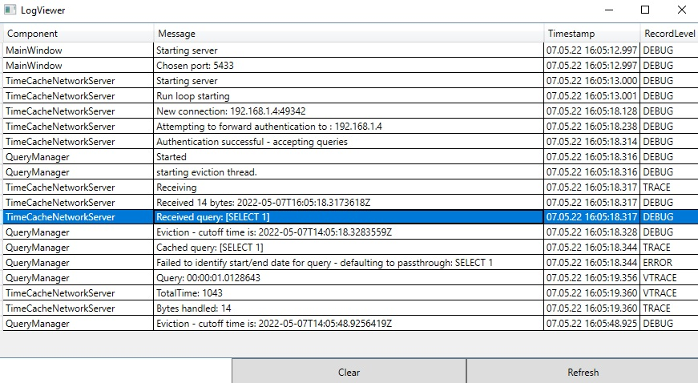
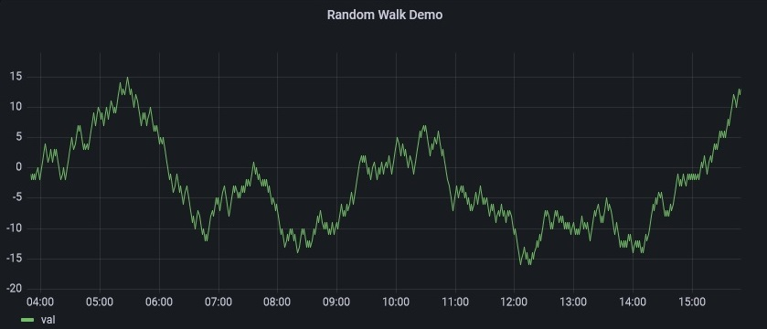
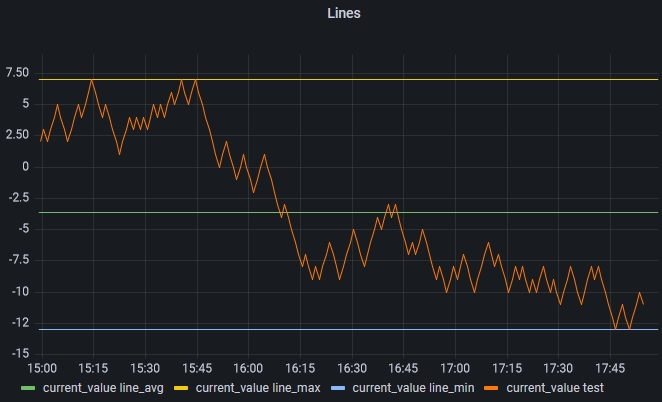

# DEMOS

## TimeCache setup

### TimeCacheGUI

App Config (TimeCacheGUI.exe.config) will need a few edits:
* DBConnectionString - Currently, we connect to the 'real' postgresql instance using a connection string stored in the app config, so this will need to
point to the desired db.
* AuthIP - Currently used for authenticating, should be the IP of the actual db server.
* PostgresqlPort - Currently used for authenticating. Port of actual server.
* Port - Port the caching service will listen on. Defaults to 5433, can also be edited through the UI prior to starting the server.

The easiest way to run TimeCache is to launch the TimeCacheGUI.exe and click 'Start'



Once running, logs can be checked to confirm the server was started successfully

### TODO: CommandLine/Console/WindowsService options

### Grafana Setup

Once TimeCache is started, we can point grafana to it by simply adding a new Postgresql data source.

* User/Password/Database should be the same credentials that would be used for the backing postgresql database. TimeCache will relay
the authentication information to the server.
* TLS/SSL is currently not supported

Save & Test should result in a 'Database Connection OK' message in grafana.

If using the GUI, clicking 'Logs' should show some simple information about the incoming connection attempt.
Grafana will (at least for now) run a simple 'SELECT 1' to verify connectivity.




TODO: Error handling

# Setup
These demos will utilize some helpers from TimeCachePGExtensions ()
Alternatively, any existing data can be use.

## Prep PGExtensions

TODO: Build/Include PGExtensions

1) Run the following to create our helper method
```
CREATE TYPE __timepoint as (time timestamp with time zone, val integer);

CREATE OR REPLACE FUNCTION public.generate_randomwalk_series(
	timestamp with time zone,
	timestamp with time zone,
	interval,
	integer)
    RETURNS SETOF __timepoint 
    LANGUAGE 'c'
    COST 1
    IMMUTABLE PARALLEL UNSAFE
    ROWS 1000

AS 'TimeCachePGExtensions', 'generate_randomwalk_series';

```
Now we can generate a random walk series fairly easily, in grafana this is just:
```
SELECT * 
from generate_randomwalk_series($__timeFrom()::timestamptz, 
                                $__timeTo()::timestamptz, interval '1m', 1)
```


Note: For testing, we will want a fixed table, so we'll use a simple definition
```
CREATE TABLE demo.timeseries
(
    metric_name text NOT NULL,
    sample_time timestamp with time zone NOT NULL,
    current_value numeric NOT NULL
)
```
Add some data: 
```
INSERT INTO demo.timeseries
select 'test', time, val from
generate_randomwalk_series(CURRENT_TIMESTAMP - interval '3 hours', 
                           CURRENT_TIMESTAMP, interval '1m', 1)
```

In grafana our base query now will be:

```
SELECT metric_name, sample_time as time, current_value
FROM demo.timeseries
where $__timeFilter(sample_time)
order by time asc 
```

### MetaCommands
#### Lines
To add lines, we simply decorate the query with the 'lines' command:
```
[{lines}]SELECT metric_name, sample_time as time, current_value
FROM demo.timeseries
where $__timeFilter(sample_time)
order by time asc 
```
The default command will draw lines for min,max and average
NOTE: In newer/latest grafana we have to allow the 'Connect null values' in order for points to be connected, otherwise we end up with single points.
Alternatively we can use the 'fill' option to allow our generate lines to be filled in at a regular interval, eg: fill=1m for 1 minute spacings



