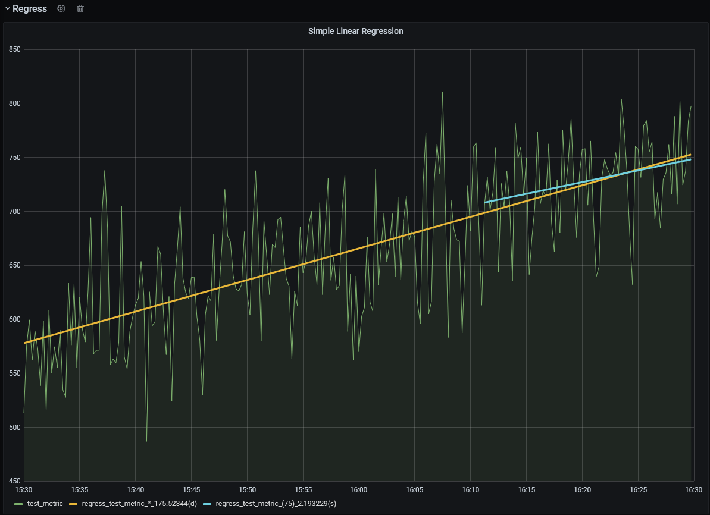
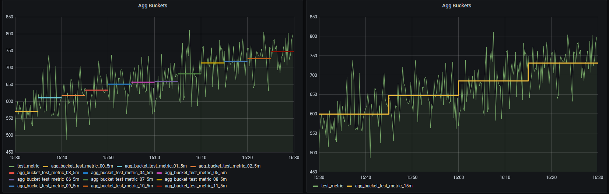
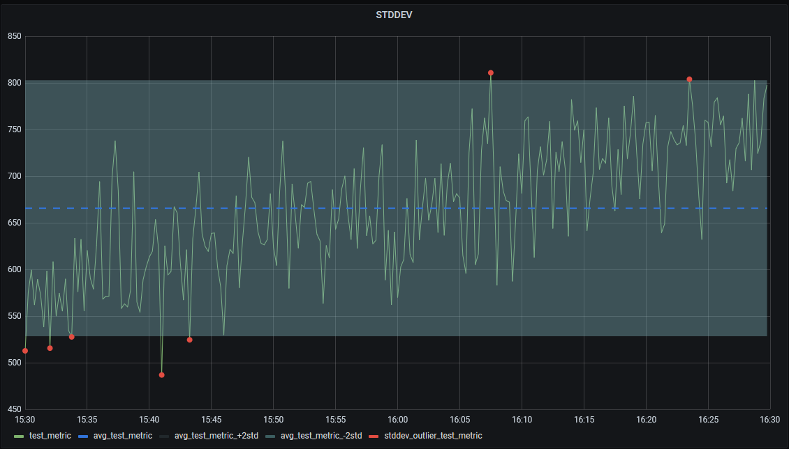
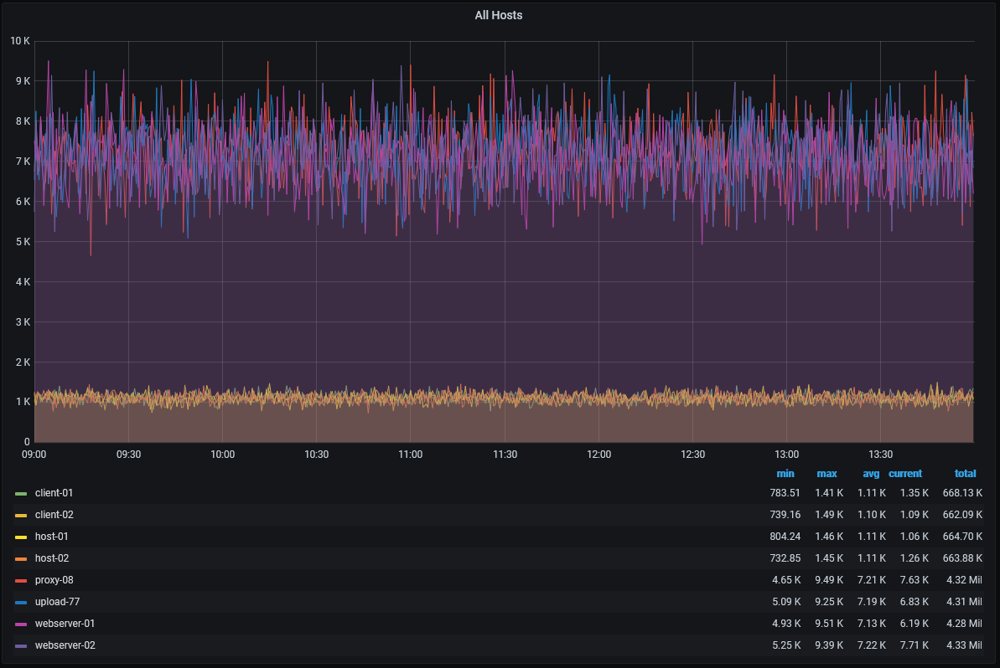
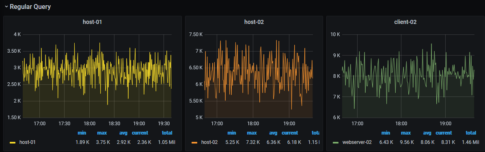

# TimeCache
-----------------------

TimeCache is a simple C# proxy server that is intended to sit between grafana and postgresql/timescale and cache results of common queries to offload some of the database work.


## What can it do?

1) Cache results of popular (or fixed) queries, so subsequent updates only need to hit the database for 'new' data. This frees up the database considerably when lots of dashboards are displaying information that is largely static (ie "old" data that is unlikely to change). Queries are 'normalized' so duplicate queries from different dashboards can all share the same cache.
2) Meta-Commands for some very simple data analysis overlays within grafana charts.
3) Decomposition of queries so multiple queries that may only differ in a predicate filter can share cached data. (A work in progress)


### Libraries/Programs used:
* NPGSQL
* Postgresql with Timescaledb
* Grafana
----------------------------
# Caching Overview

----------------------------
# Meta-Commands/Options
TimeCache supports prefixing queries with additional commands or options that can extend or modify the behavior of a query.

The structure of commands/options is:

`[{command1},{command2},...,{commandN}]{option1,...,optionN}query`
## Meta-Commands
Meta-Commands are special queries that will return additional timeseries data in addition to the results of the original query.

These commands can also include options as simple key=value pairings that control only the behavior of the meta-command. Options specified outside of the
command block apply to the main query.

`[{command,key=value}]`
Ex: `[{regress,points=20}]`

Not all commands will support options. Options may share names amongst commands, but vary slightly in behavior.

Usage Notes: (These will be demonstrated in example graphs below..)
* Commands can be repeated for the same query, allowing different options. (IF different options are not used, the resulting data will be duplicative).
* Commands are evaluated per-series, so queries returning multiple metrics will have multiple command results.

### Supported commands

#### Regress
Simple linear regression. Plots a straight line. The metric name will include the slope of the line (ie change in y value per x unit)

##### Options
* Points := Integer, Determines the number of data points used for the calculation. Default will be all points in range. Points will be taken from newest to oldest.
* Difference := Boolean, Instead of naming the metric with the slope, it will instead be named with the difference in y-values.



The returned series will be named after the original metric, and include the number of points (* for all), followed by either the slope (s) or difference (d)

#### Agg Buckets
Average of points in sub-intervals. Shows the average value over small intervals of time within a window.

##### Options
* Interval := Text. Default 1h. Determines how wide the buckets should be. Supports w=weeks,d=days,h=hours,m=minutes,s=seconds. Should not be provided with quotes or extra spaces
* Separate := Boolean. Default is false. Allows buckets to be returned as separate lines



#### STDDEV
Standard deviation bounds. Draws fixed lines representing the average, avg + Nxstd and avg - Nxstd.
##### Options
* deviations := Integer. Default is 2. # of standard deviations to use when computing range/drawing lines.
* highlight := Boolean Default is false. Allows identifying points that fall outside the box formed by average +- standard deviation.

This example uses 2 commands, one to draw the box, and one to highlight outliers. Note: Uses several overrides within grafana for displaying a nicer view:



----------------------------
# Decomposition
### What is it?
A caching option that allows similar queries to share cached data.

#### Why would I want it?
* Minimize the actual number of queries issued to the database (to 1)
* Row data is filtered by the caching server, not the database so it further frees up DB resources.

#### Motivating example: (100% contrived)
Let's say we want to look at resource utilization from our sample data. One option is to use a single query and graph everything in the same chart:

``` 
   SELECT machine_name, $__timeGroup(sample_time, '30s', 0), avg(current_value)
   FROM stats.timeseries_data_id
   inner join stats.categories on categories.id = category_id and category_name = 'cpu'
   inner join stats.counters on counters.id = counter_id and counter_name = 'handles'
   inner join stats.instances on instances.id = instance_id and instance_name = 'devenv'
   inner join stats.machines on machines.id = machine_id
   where $__timeFilter(sample_time)
   --and machine_name = 'host-01'
   group by 1,2
   order by 2 asc
```

Resulting in:


This is certainly simple, but has the unfortunate consequence that our machines might be on different scales entirely. One solution would be to change the chart to a log base 2/log base 10 scale for the y axis, but if we're looking for changes in an individual host, it can be hard to see on a scaled axis.
Another option is to duplicate the query for all machines (Grafana can do this a bit more easily using a templated variable + repeating options, but this example just hardcodes the query for each of the 3 charts). The updated query looks like the following, with only changes to the machine_name predicate:
```
    SELECT machine_name, $__timeGroup(sample_time, '30s', 0), avg(current_value)
    FROM stats.timeseries_data_id
    inner join stats.categories on categories.id = category_id and category_name = 'cpu'
    inner join stats.counters on counters.id = counter_id and counter_name = 'handles'
    inner join stats.instances on instances.id = instance_id and instance_name = 'devenv'
    inner join stats.machines on machines.id = machine_id
    where $__timeFilter(sample_time)
    **and machine_name = 'host-01'**
    group by 1,2
    order by 2 asc
 ```



The good news is now any signifcant change in any metric will be easier to spot, as each has in independent scale and won't be lost in the mix.
Unfortunately, the bad news is we are now issuing 3 separate queries to the database. Since these queries are *almost* identical, we can take advantage of the fact that we are already caching data, and 'normalize' a way a bit more of the query to allow all three charts to share data.

To enable the decomposition, all we need to do is add the query option:
`{decomp=true}` at the start of the query. This effectively turns the query into:

```
    SELECT machine_name, $__timeGroup(sample_time, '30s', 0), avg(current_value)
    FROM stats.timeseries_data_id
    inner join stats.categories on categories.id = category_id and category_name = 'cpu'
    inner join stats.counters on counters.id = counter_id and counter_name = 'handles'
    inner join stats.instances on instances.id = instance_id and instance_name = 'devenv'
    inner join stats.machines on machines.id = machine_id
    where $__timeFilter(sample_time)
    group by 1,2
    order by 2 asc
 ```
Internally, the query is parsed and any extra predicates (excluding the $__timeFilter which is handled by 'normal' caching logic) are extracted, and will be used to filter the cached rows prior to returning the results to grafana. This means instead of 3 queries for the above charts, we will only issue 1 (And in the case where data is fully cached, we will issue 0 queries!)

#### Requirements/Limitations
* Query parsing is only done at an extremely basic level using regular expressions, so this option is limited to simple queries like the example. Selecting a grouping column, a timestamp, and a value, and filtering on the grouping column.
* Similiar-ness of a query is determined by simple text matching, not query meaning, so
  * If one query groups by '60s' and another by '1m', they will be treated as separate queries and not share cache
  * If joins were done in a different order, these are now different queries...


-----------------------------
Solution Overview

TimeCacheGUI - Simple WPF application to allow starting/stopping a server and viewing logs.
TimeCacheService - Allows running the TimeCacheNetworkServer as a windows service. Logs periodically flushed to disk.
TimeCacheNetworkServer - Actual server/caching implementation, all the fun stuff is in here.
PostgresqlCommunicator - Handles postgresql wire format. Allows parsing the connection info from grafana's requests and translating the c# data table back into the raw psql format for grafana.

Other:
SLog - Extremely simple logging helper.
SimpleStatsGenerator - Small executable to generate testing data.
Utils - Helper classes, table manager for bulk inserting sample stats.

--------------------------------------
Getting started

To have grafana talk to a TimeCacheNetworkServer, it simply needs to be added as a postgresql data source. It mimics enough of the connection setup so grafana will recognize it as a valid postgresql db. 
Note: Currently it does NOT support any TLS/SSL modes.
