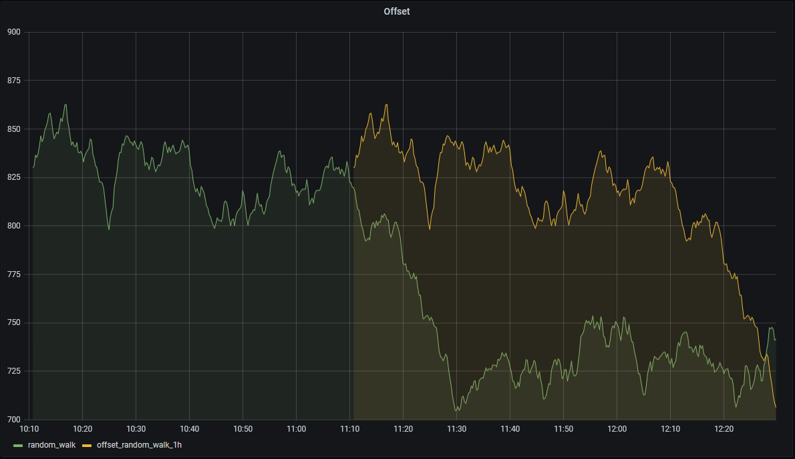
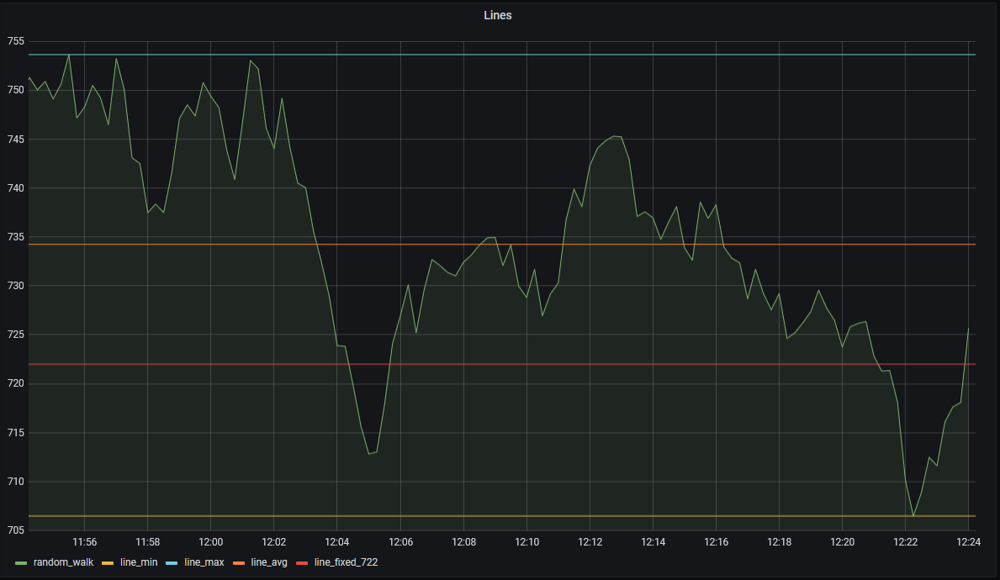
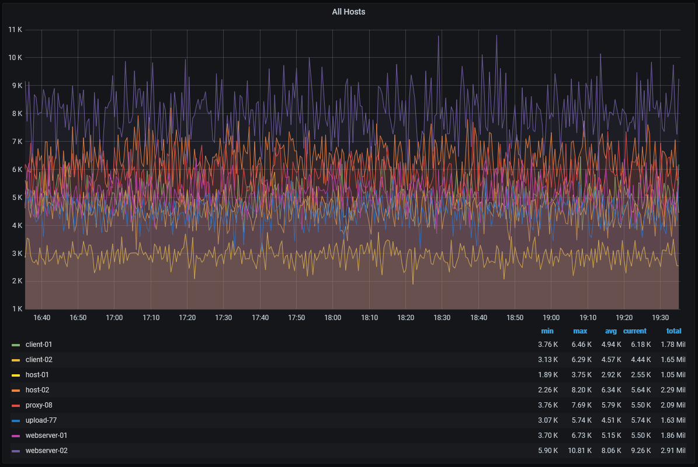

# TimeCache
-----------------------

TimeCache is a simple C# proxy server that is intended to sit between grafana and postgresql/timescale to cache query results and provide some simple analytic overlays for data charts.

## Note!
This was initially written as a proof of concept, to see how difficult it would be to intercept postgres traffic and respond with additional data. It has slowly been morphing into a more legitimate project, but the code is still pretty rough. A good refactoring/cleanup may happen eventually, but for now this is more of a (sometimes) functional demo.


## What can it do?

1) Cache results of popular (or fixed) queries, so subsequent updates only need to hit the database for 'new' data. This frees up the database considerably when lots of dashboards are displaying information that is largely static (ie "old" data that is unlikely to change). Queries are roughly normalized so duplicate queries from different dashboards can all share the same cache.
2) Meta-Commands that allow some *very* simple data analysis overlays within grafana charts.
3) Decomposition of queries so multiple queries that may only differ in the predicate filter can share cached data. (A work in progress)


### Libraries/Programs involved:
* NPGSQL(https://www.npgsql.org/) (Some Postgresql messaging is managed directly, but most queries will utilize NPGSQL since its a proper library)
* Postgresql (https://www.postgresql.org/) (TimescaleDB optional: https://www.timescale.com/)
* Grafana  (https://grafana.com/)

----------------------------
# Caching Overview
One of the main goals is to support caching recent query results, so subsequent queries can be modified to fetch only 'new' rows. This is designed for dashboard queries, where we may be looking at the last 1-3 hours, and constantly refreshing. Since most old data rarely changes, we don't really need to query the full window, only the most recent edge(and a small 'update' window).

A configuration option through CachedQueryConfig.cs is planned to allow 'fixed' queries to always be in the cache, but any query that executes will be 

Considerations:
* If data frequently takes a while to make it into the database, using cached data is probably a bad idea. If data only sometimes comes in late, but is generally loaded in near real-time, this should work reasonably well. An update window can be used to increase the window of data that will be re-queried each refresh.
* A flag allows for disabling the cache, so the query will be passed directly on to the database and the results not stored. 

Caching TODO
* Caches could be periodically re-queried, either in full or in small chunks to ensure long-term validity. One option would be to determine frequent queries, and automatically add them to the CachedQueryConfig schedule.
* Finish implementing/testing the query config to allow scheduled queries.
* Finish implementing cache-timeout/eviction due to memory pressure (oldest / last accessed)

----------------------------
# Meta-Commands/Options
TimeCache supports prefixing queries with additional commands or options that can extend or modify the behavior of a query.

Note: This results in queries that are NOT valid SQL. 

The structure of commands/options is:

`[{command1},{command2},...,{commandN}]{option1,...,optionN}query`

Example: This uses the 'Lines' command with a command option to draw a fixed line, and specify the 'metaonly' query option so we dont return the underlying data.
```
[{lines,fixed=722}]{metaonly=true}select metric_name, $__timeGroup(sample_time, '15s'), avg(current_value)
from test.simple_test
where $__timeFilter(sample_time)
group by 1,2
order by 2 asc
```

## Meta-Commands
Meta-Commands are special queries that will return additional timeseries data in addition to the results of the original query.

These commands can also include options as simple key=value pairings that control only the behavior of the meta-command. Options specified outside of the
command block apply to the main query.

`[{command,key=value}]`
Ex: `[{regress,points=20}]`

Note: Not all commands will support options. Options may also share names amongst commands, but vary slightly in behavior.

Usage Notes: (These will be demonstrated in example graphs below..)
* Commands can be repeated for the same query, allowing different options. (IF different options are not used, the resulting data will be duplicative).
* Commands are evaluated per-series, so queries returning multiple metrics will have multiple command results.

Note: Many of these (like 'lines' or 'agg_buckets') are super simple and can easily be done via regular queries without too much effort. Implementing them as custom commands is done to make it easy to enable/disable them or easily adjust based on params without having to deal with copy/pasting/modifying an existing long query. Commands have access to the cached data already, so we are not burdening the db with any additional queries to generate them.

### Supported commands

<details><summary>OFFSET</summary>

<p>

### Offset
Time-shifts data to overlay it onto current/newer data. Allows an easier comparison of recent data to older data.


#### Options
* Interval := string - Timespan to shift data. Default is '1h'


</p>
</details>
   
<details><summary>REGRESS</summary>
<p>

### Regress
Simple linear regression. Plots a straight line. The metric name will include the slope of the line (ie change in y value per x unit)

##### Options
* Points := Integer, Determines the number of data points used for the calculation. Default will be all points in range. Points will be taken from newest to oldest.
* Difference := Boolean, Instead of naming the metric with the slope, it will instead be named with the difference in y-values.


The returned series will be named after the original metric, and include the number of points (* for all), followed by either the slope (s) or difference (d)
<p>
</details>

<details><summary>AGG BUCKETS</summary>
   
<p>

### Agg Buckets
Aggregate data into sub-intervals for stats. Can currently show either the SUM or AVG of data within each bucket.

##### Options
* Interval := string. Default 1h. Determines how wide the buckets should be. Supports w=weeks,d=days,h=hours,m=minutes,s=seconds. Should not be provided with quotes or extra spaces
* Separate := Boolean. Default is false. Allows buckets to be returned as separate lines
* Method := string. Default 'AVG', Only other supported option is 'SUM'.


</p>
</details>
   
<details><summary>STDDEV</summary>
<p>

#### STDDEV
Standard deviation bounds. Draws fixed lines representing the average, avg + Nxstd and avg - Nxstd.
##### Options
* deviations := Integer. Default is 2. # of standard deviations to use when computing range/drawing lines.
* highlight := Boolean Default is false. Allows identifying points that fall outside the box formed by average +- standard deviation.

This example uses 2 commands, one to draw the box, and one to highlight outliers. Note: Uses several overrides within grafana for displaying a nicer view:


</p>
</details>

<details><summary>LINES</summary>
  
<p>

### LINES
Simple horizontal lines. 

#### Options
* 'avg|min|max' := Boolean - Allows limiting lines to only min,max, or avg. By default, all 3 will be enabled unless 'fixed' is specified
* 'fixed' := string - Draws a horizontal line at the specified value. Supports format specifier postfix 'k|m|b' thousands/millions/billions for shorthand (fixed=4b is equivalent to fixed=4000000000)


   </p>
</details>


# Decomposition
#### What is it?
A caching option that allows similar queries to share cached data.


#### Motivating example:
Let's say we want to look at resource utilization from our sample data. One option is to use a single query and graph everything in the same chart:

``` 
   SELECT machine_name, $__timeGroup(sample_time, '30s', 0), avg(current_value)
   FROM stats.timeseries_data_id
   inner join stats.categories on categories.id = category_id and category_name = 'cpu'
   inner join stats.counters on counters.id = counter_id and counter_name = 'handles'
   inner join stats.instances on instances.id = instance_id and instance_name = 'devenv'
   inner join stats.machines on machines.id = machine_id
   where $__timeFilter(sample_time)
   --and machine_name = 'host-01'
   group by 1,2
   order by 2 asc
```

Resulting in:


This is certainly simple, but has the unfortunate consequence that our machines might be on different scales entirely. One solution would be to change the chart to a log base 2/log base 10 scale for the y axis, but if we're looking for changes in an individual host, it can be hard to see on a scaled axis.
Another option is to duplicate the query for all machines (Grafana can do this a bit more easily using a templated variable + repeating options, but this example just hardcodes the query for each of the 3 charts). The updated query looks like the following, with only changes to the machine_name predicate:
```
    SELECT machine_name, $__timeGroup(sample_time, '30s', 0), avg(current_value)
    FROM stats.timeseries_data_id
    inner join stats.categories on categories.id = category_id and category_name = 'cpu'
    inner join stats.counters on counters.id = counter_id and counter_name = 'handles'
    inner join stats.instances on instances.id = instance_id and instance_name = 'devenv'
    inner join stats.machines on machines.id = machine_id
    where $__timeFilter(sample_time)
    **and machine_name = 'host-01'**
    group by 1,2
    order by 2 asc
 ```


The good news is now any signifcant change in any metric will be easier to spot, as each has in independent scale and won't be lost in the mix.
Unfortunately, the bad news is we are now issuing 3 separate queries to the database. Since these queries are *almost* identical, we can take advantage of the fact that we are already caching data, and 'normalize' a way a bit more of the query to allow all three charts to share data.

To enable the decomposition, all we need to do is add the query option:
`{decomp=true}` at the start of the query. This effectively turns the query into:

```
    SELECT machine_name, $__timeGroup(sample_time, '30s', 0), avg(current_value)
    FROM stats.timeseries_data_id
    inner join stats.categories on categories.id = category_id and category_name = 'cpu'
    inner join stats.counters on counters.id = counter_id and counter_name = 'handles'
    inner join stats.instances on instances.id = instance_id and instance_name = 'devenv'
    inner join stats.machines on machines.id = machine_id
    where $__timeFilter(sample_time)
    group by 1,2
    order by 2 asc
 ```
Internally, the query is parsed and any extra predicates (excluding the $__timeFilter which is handled by 'normal' caching logic) are extracted, and will be used to filter the cached rows prior to returning the results to grafana. This means instead of 3 queries for the above charts, we will only issue 1 (And in the case where data is fully cached, we will issue 0 queries!)

#### Requirements/Limitations
* Query parsing is only done at an extremely basic level using regular expressions, so this option is limited to simple queries like the example. Selecting a grouping column, a timestamp, and a value, and filtering on the grouping column.
* Similiar-ness of a query is determined by simple text matching, not query meaning, so
  * If one query groups by '60s' and another by '1m', they will be treated as separate queries and not share cache
  * If joins were done in a different order, these are now different queries...

#### Why would I want it?
* Minimize the actual number of queries issued to the database (ideally down to just 1)
* Row data is filtered by the caching server, not the database so it further frees up DB resources.
* Can still take advantage of caching, so even though we're issuing a more generic query, it should be less impactful than multiple filtered queries.

#### Why would I NOT want it?
* Depending on the cardinality of the source data, limiting by a handful of items of interest may significantly cut down on the number of rows retrieved/stored. The current implementation of Decomposition simply removes the predicate (A more ideal version may be to use 'IN' and still issue a limited query, so we know all cached rows are actually of interest and can reduce some of the potential bloat).

## Getting Started
See /Demos (Work in progress) for setup/demonstrations


#### Other:
-----------------------------
Core Projects:

TimeCacheGUI - Simple WPF application to allow starting/stopping a server and viewing logs.

TimeCacheService - Allows running the TimeCacheNetworkServer as a windows service. Logs periodically flushed to disk.

TimeCacheNetworkServer - Actual server/caching implementation, all the fun stuff is in here.

PostgresqlCommunicator - Handles postgresql wire format. Allows parsing the connection info from grafana's requests and translating the c# data table back into the raw psql format for grafana. This is not intended in any way to try to replace Npgsql. Message handling is very basic and only supports basic connections and simple queries.
